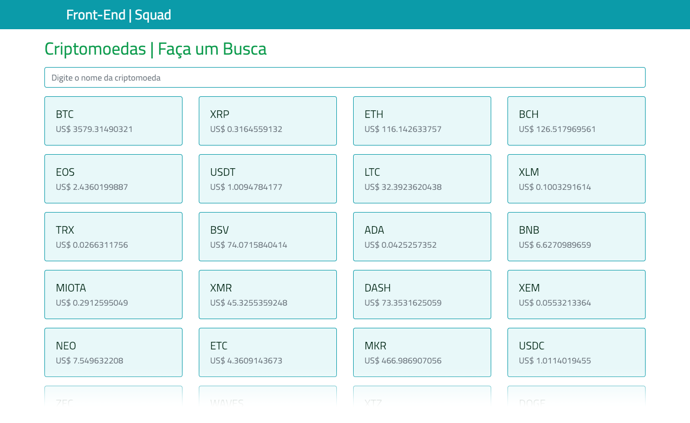

# Lucio Moura



Clone o projeto e siga as instrucoes de abaixo.

### Instalar dependências
Para instalar as dependencias digite no console:
```
npm install
```

### Compilar e iniciar o projeto
Para compilar o projeto:
```
npm start
```
### Compilar e minificar para produção
```
npm build
```
